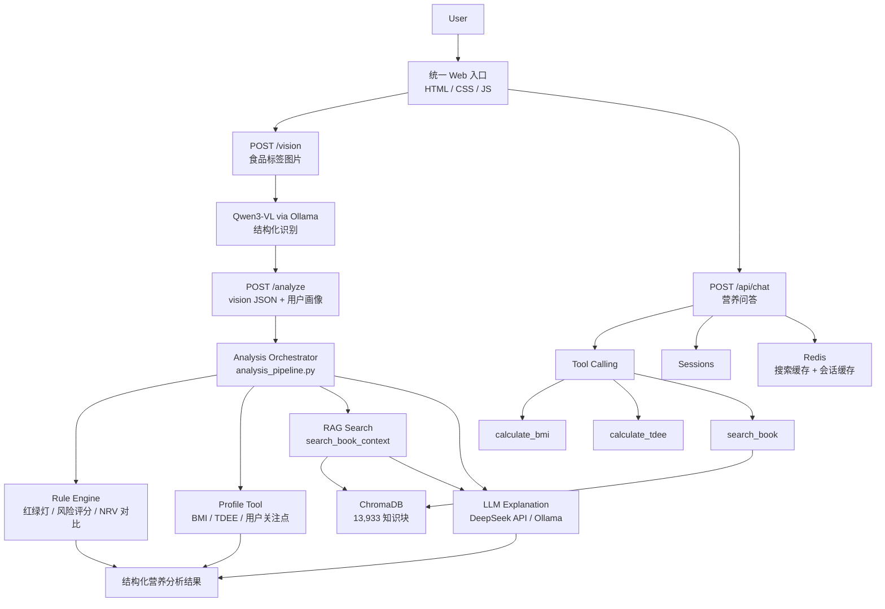

# 食鉴 V3

食品标签识别 + 营养知识 RAG + 个性化分析的 AI Agent 学习项目。

当前版本是 **V3：统一入口的多能力食鉴 Agent**。它把原来的营养知识问答和食物配料拍照分析整合到同一个 Web 界面中：

- **配料分析**：拍照上传食品标签，识别配料、添加剂和营养成分，生成红绿灯风险和个性化建议。
- **营养问答**：基于《中国营养科学全书（第2版）》的 RAG 知识库问答，支持 BMI / TDEE 工具调用。
- **分析编排**：规则引擎负责确定性判断，RAG 提供知识依据，LLM 负责自然语言解释。

## Highlights

- **多能力 Agent 入口**：同一套 Web UI 支持食品标签拍照分析和营养知识问答。
- **规则 + RAG + LLM 分层设计**：风险评级由规则引擎确定，知识依据来自 RAG，LLM 只负责解释和表达。
- **可落地的个性化分析**：结合 BMI / TDEE、用户关注点、NRV 对比和红绿灯指标生成建议。
- **双模型后端**：支持 DeepSeek API，也支持 Ollama 本地模型和 Qwen3-VL 视觉识别。
- **工程化闭环**：FastAPI、ChromaDB、Redis、Docker Compose、轻量规则测试和端到端测试。

## Architecture



## Design Philosophy

本项目的核心设计原则是：**风险判断交给规则引擎，LLM 只负责解释和表达**。这样既能保持回答自然，也能避免模型随意改变风险等级。

| 模块 | 职责 | 设计原因 |
|------|------|----------|
| Rule Engine | 红绿灯、风险等级、NRV 对比、个性化确定性建议 | 输出稳定、可测试、可审计，适合承载健康风险判断 |
| RAG | 从《中国营养科学全书（第2版）》检索相关依据 | 为解释提供知识来源，减少无依据回答 |
| LLM | 结合规则结果和 RAG 上下文生成自然语言解读 | 擅长表达、总结和面向用户的解释 |

不使用 LLM 判断风险，是因为食品风险评级需要**一致性、可复现性和可单测覆盖**。如果把风险等级交给 LLM，同一输入可能因为模型版本、提示词或采样参数变化而得到不同结论；规则引擎则能把关键阈值和判断路径显式保留在代码中。

## 技术栈

| 层 | 技术 | 说明 |
|----|------|------|
| PDF 提取 | PyMuPDF | 章节感知提取，目录层级重建，1927 章 |
| 嵌入 | sentence-transformers (MiniLM-L12-v2) | 384 维中文向量 |
| 向量库 | ChromaDB | 本地持久化，L2 归一化 |
| 后端 | FastAPI | 统一入口：问答、识图、分析 API |
| 前端 | HTML/CSS/JS（零框架） | 配料分析 + 营养问答双菜单 |
| LLM | DeepSeek API / Ollama | 文本分析、问答、工具调用 |
| 视觉模型 | Qwen3-VL via Ollama | 食品标签拍照识别 |
| 缓存 | Redis | 搜索缓存 + 会话缓存，TTL 自动过期 |
| 规则引擎 | Python | 红绿灯、风险评分、NRV 对比 |
| 部署 | Docker Compose | 一键编排，食鉴 + Redis |

## 快速开始

### Docker Compose（推荐）

```bash
# 1. 创建 .env
echo 'DEEPSEEK_API_KEY=你的key' > .env
echo 'LLM_PROVIDER=deepseek' >> .env

# 2. 一键启动（食鉴 V3 + Redis）
docker-compose up -d --build
```

浏览器打开 http://localhost:8000

统一入口包含两个下级功能：

- 配料分析：拍照上传食品标签，识别配料和营养成分并生成建议。
- 营养问答：基于本地营养知识库进行 RAG 问答，支持 BMI / TDEE 工具调用。

> 首次构建约 5-10 分钟。后续启动秒级。
> 知识库需提前构建（见下方"构建知识库"），或从已有环境拷贝 `chroma_db/` 目录。

### 手动安装

#### 1. 安装依赖

```bash
pip install -r requirements.txt
```

#### 2. 配置

```bash
cp .env.example .env
# 编辑 .env，填入 DeepSeek API Key
```

#### 3. 构建知识库（仅首次）

```bash
python build.py
```

预计 1-3 分钟，消耗 1-2GB 显存，完成后 `chroma_db/` 约 25MB。

#### 4. 启动

```bash
python server.py
```

浏览器打开 http://127.0.0.1:8000

## 本地模型（可选）

RTX 4060 Ti 8GB 实测可用。无需 API Key，数据不出本机。

```bash
# 安装 Ollama → https://ollama.com
ollama pull qwen2.5:7b
ollama pull qwen3-vl:8b

# 修改 .env
LLM_PROVIDER=ollama
OLLAMA_VISION_MODEL=qwen3-vl:8b
```

不使用时释放显存：

```bash
ollama stop qwen2.5:7b
```

> **7B 模型的局限**：Function Calling 不如 DeepSeek 稳定，可能漏调工具或直接编造数字。本项目已内置保底策略——后端自动从消息中提取身高/体重计算 BMI，自动搜索知识库，大幅降低幻觉。但极端情况下仍可能出现偏差，重要查询建议切回 DeepSeek。

## 项目结构

```
nutri_ai/
├── docker-compose.yml    # 食鉴 + Redis 一键编排
├── Dockerfile
├── cache.py              # Redis 缓存：搜索 + 会话
├── server.py             # FastAPI 统一入口：问答 + 识图 + 分析
├── analysis_pipeline.py  # 食鉴 V3 分析编排：规则 → RAG → LLM → 组装
├── rules.py              # 规则引擎：红绿灯、风险评分、NRV 对比
├── user_profile.py       # BMI / TDEE / 用户画像
├── llm_analysis.py       # Prompt、RAG 上下文、LLM 解读
├── analyze.py            # 兼容入口：保留 CLI 和 full_analysis 导出
├── engine.py             # RAG 引擎
├── extract.py            # PDF 提取
├── build.py              # 知识库构建
├── static/
│   ├── index.html        # 统一页面：配料分析 + 营养问答
│   ├── app.js
│   └── style.css
├── tests/
│   ├── test_rules.py     # 不调用模型的轻量规则测试
│   └── batch_test.py     # vision → analyze 端到端测试
├── extracted/
├── chroma_db/
├── sessions/
├── .env.example
└── README.md
```

## 测试

快速规则测试不调用视觉模型、RAG 或 LLM，适合每次改规则后先跑：

```bash
python -m unittest tests.test_rules
```

完整端到端测试会调用 vision → analyze，适合改识图链路或分析编排后跑：

```bash
python tests/batch_test.py
```

## API

| 方法 | 路径 | 说明 |
|------|------|------|
| `POST` | `/api/chat` | 发送消息 `{"session_id":"...", "message":"..."}` |
| `POST` | `/api/sessions` | 创建新会话 |
| `GET` | `/api/sessions` | 列出所有会话 |
| `GET` | `/api/sessions/{id}` | 获取会话聊天记录 |
| `DELETE` | `/api/sessions/{id}` | 删除会话 |
| `GET` | `/api/health` | 健康检查（模型、知识库状态） |
| `POST` | `/vision` | 上传食品标签图片，返回结构化识别结果 |
| `POST` | `/analyze` | 输入 vision JSON + 用户画像，返回营养分析 |

## Agent 编排

### 营养问答工具

| 工具 | 触发条件 | 实现 |
|------|---------|------|
| `calculate_bmi` | 用户提供身高 + 体重 | Python 精确计算 |
| `calculate_tdee` | 用户提供性别/年龄/身高/体重/活动量 | Mifflin-St Jeor 公式 |
| `search_book` | 营养学知识问题 | 向量检索 → ChromaDB top-5 |

本地模型漏调工具时，后端自动触发补算和搜书，确保回答有据可依。

### 配料分析链路

| 层级 | 模块 | 责任 |
|------|------|------|
| Vision | `vision.py` | Qwen3-VL 识别食品标签，输出结构化 JSON |
| Rule Agent | `rules.py` | 红绿灯、风险等级、NRV 对比、确定性建议 |
| Profile Tool | `user_profile.py` | BMI、TDEE、用户画像文本 |
| RAG / LLM Agent | `llm_analysis.py` | 检索营养知识库并生成自然语言解读 |
| Orchestrator | `analysis_pipeline.py` | 编排规则、检索、LLM 并行和结果组装 |

## 版本演进

| 版本 | 定位 | 关键能力 |
|------|------|------|
| V1 | 小行健康助手 | 7 篇手写知识、BMI/TDEE、Gradio 原型 |
| V2 | 食鉴 RAG 问答 | 《中国营养科学全书》全文索引、ChromaDB、DeepSeek / Ollama 双后端、多会话 |
| V3 | 多能力食鉴 Agent | 统一 Web 入口、配料拍照分析、营养问答、规则引擎、RAG/LLM 分层编排、轻量规则测试 |
